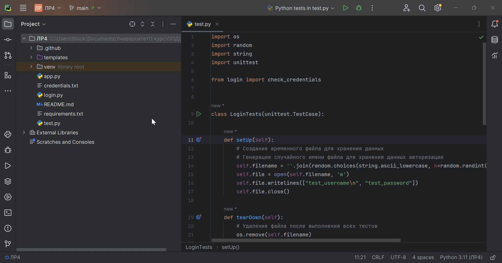

# Лабораторная работа №3
По дисциплине "Основы профессиональной деятельности".

Выполнил студент группы ПИН-222 Корноухов Роман.

**Вариант 7.** Создание страницы авторизации, логин и пароль в файле.

